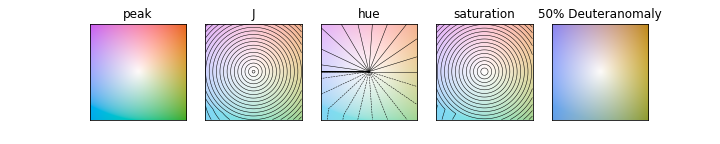
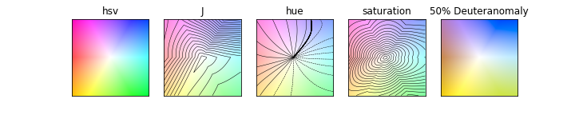

.. _helpers:

colorstamps.helpers module
--------------------------

Apply colormap to data
******************************************
.. autofunction:: colorstamps.helpers.apply_stamp

Example:

.. code-block:: python

	import numpy as np
	import matplotlib.pyplot as plt
	import colorstamps
	# img = (100,200,2) example data 
	img = colorstamps.helpers.get_random_data() 
	# map data to colormap
	fig, axes = plt.subplots(1,2,figsize=(10,3), dpi = 100)    

	'''
	inputing cmap to colorstamps.apply_stamp() by name
	'''
	rgb, stamp = colorstamps.apply_stamp(img[:,:,0], img[:,:,1], 
		                           'cut', rot = 45,
		                           vmin_0 = -1.2, vmax_0 = 1.2,
		                           vmin_1 = -1, vmax_1 = 1,
		                         )

	axes[0].imshow(rgb)
	overlaid_ax = stamp.overlay_ax(axes[0], 
			lower_left_corner = [0.7,0.85], width = 0.2)

	'''
	getting cmap firts (as a numpy array) 
	and rotating the cmap 90 degrees
	Then sending to colorstamps.apply_stamp()
	'''
	cmap_as_array = colorstamps.stamps.get_cmap('cut', rot = 45)
	cmap_as_array = np.rot90(cmap_as_array)
	rgb, stamp = colorstamps.apply_stamp(img[:,:,0], img[:,:,1], 
		                           cmap_as_array,
		                           vmin_0 = -1.2, vmax_0 = 1.2,
		                           vmin_1 = -1, vmax_1 = 1,
		                         )    
	axes[1].imshow(rgb)
	overlaid_ax = stamp.overlay_ax(axes[1], 
			lower_left_corner = [0.7,0.85], width = 0.2)
	
.. image:: ./images/apply_stamp.png

If a circular colormap is passed as an array, you must also set clip = 'circle'.
Here we show both without and with the clip = 'circle' option:

.. code-block:: python

	fig, axes = plt.subplots(1,2,figsize=(10,3), dpi = 100)    
	cmap_as_array = colorstamps.stamps.get_cmap('cone')

	rgb, stamp = colorstamps.apply_stamp(img[:,:,0], img[:,:,1], 
			cmap_as_array)    
	axes[0].imshow(rgb)
	overlaid_ax = stamp.overlay_ax(axes[0], 
			lower_left_corner = [0.7,0.85], width = 0.2)

	rgb, stamp = colorstamps.apply_stamp(img[:,:,0], img[:,:,1], 
			cmap_as_array, clip = 'circle')    
	axes[1].imshow(rgb)
	overlaid_ax = stamp.overlay_ax(axes[1], 
			lower_left_corner = [0.7,0.85], width = 0.2)

.. image:: ./images/apply_stamp1.png

The 'clip' options determines the behaviour when a point outside the colormap is requested. The following image shows the different options.

.. image:: ./images/point_outside_colormap.png

The Stamp class
**********************
.. autoclass:: colorstamps.Stamp
   :members:
   
   
Example use of colorstamps.Stamp.eval()

.. code-block:: python

	import colorstamps
	
	stamp = colorstamps.Stamp('peak')
	fig, ax = stamp.eval()
	stamp = colorstamps.Stamp('hsv')
	fig, ax = stamp.eval()
	stamp = colorstamps.Stamp('fourEdges')
	fig, ax = stamp.eval()
	

.. image:: ./images/Stamp2.png
	
