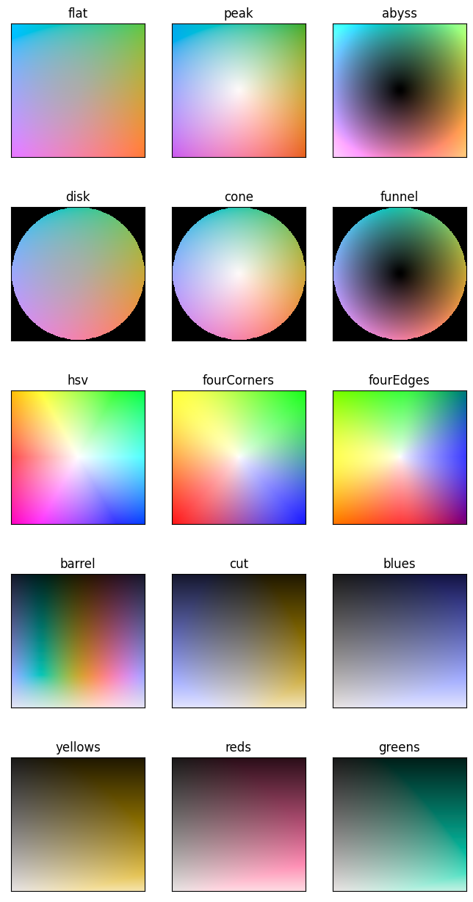

.. colorstamps documentation master file, created by
   sphinx-quickstart on Thu Jan  6 14:12:41 2022.
   You can adapt this file completely to your liking, but it should at least
   contain the root `toctree` directive.

Welcome to colorstamps's documentation!
========================================
Colorstamps is a package containting 2d colormaps and helper functions to use the colormaps.
Most included colormaps are based on the 'CAM02-LCD' colorspace as defined in the package colorspacious (https://pypi.org/project/colorspacious/)

Installation
**********************

pip install colorstamps

Use
**********************
.. code-block:: python

	import matplotlib.pyplot as plt
	import colorstamps
	# img = (100,200,2) example data 
	img = colorstamps.helpers.get_random_data() 
	# map data to colormap
	rgb, stamp = colorstamps.apply_stamp(img[:,:,0], img[:,:,1], 'peak',
		                           vmin_0 = -1.2, vmax_0 = 1.2,
		                           vmin_1 = -1, vmax_1 = 1,
		                         )
	fig, axes = plt.subplots(1,2,figsize=(10,3), dpi = 100)    
	axes[0].imshow(rgb)
	# show colormap as overlay
	overlaid_ax = stamp.overlay_ax(axes[0], 
			lower_left_corner = [0.7,0.85], width = 0.2)
	overlaid_ax.set_ylabel(r'$\phi$')
	overlaid_ax.set_xlabel(r'$\omega$')
	# also show colormap as in separate ax to illustrate functionality
	stamp.show_in_ax(axes[1])
	axes[1].set_ylabel(r'$\phi$')
	axes[1].set_xlabel(r'$\omega$')
	
.. image:: ./images/example0.png

Contents
**********************

The colormaps are encoded as numpy arrays of shape (l,l,3) with rgb color values in the range 0 to 1. 

.. toctree::
   :maxdepth: 1
   :caption: Table of contents:
   
   stamps.rst
   
   helpers.rst
   
   lineplots.rst
   
   
:ref:`colorstamps.stamps <stamps>` contain functions that generate colormaps, and the :ref:`documentation <stamps>` also shows how they can be customized.

:ref:`colorstamps.helpers <helpers>` contain functions for applying the colormaps to a dataset, visualizing the colormap with the data in a matplotlib figure, and evaluating the colormap.

Quick reference
**********************
This is a quick reference of the default colormaps in :ref:`colorstamps.stamps <stamps>`

see :ref:`colorstamps.stamps <stamps>` for additional colormaps
