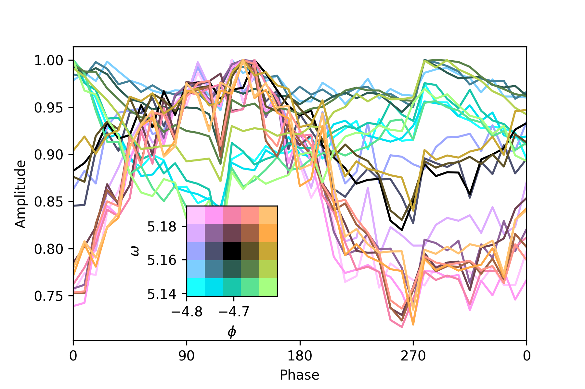

.. _lineplots:

using 2d colormap for line plots
--------------------------------

The package can be used to generate 2d colormaps to color lines in a line plot, as follows:
(see also https://github.com/trygvrad/colorstamps/tree/main/examples/color_for_line_plots.ipynb)

Example:

.. code-block:: python

	import numpy as np
	import matplotlib.pyplot as plt
	import colorstamps

	# intensities: array of shape (l,l,n)
	# omega: array of shape (l,l)
	# phi: array of shape (l,l)
	# phase: array of shape (n)

	# here l = 5, and n is 41

	var_0 = np.array(omega)
	var_1 = np.array(phi)
	l = phi.shape[0]
	rgb, stamp = colorstamps.apply_stamp(var_0, var_1, 'abyss', l = l,
		   vmin_0 = np.min(var_0) - 0.5*(np.max(var_0)-np.min(var_0))/l, 
		   vmax_0 = np.max(var_0) + 0.5*(np.max(var_0)-np.min(var_0))/l,
		   vmin_1 = np.min(var_1) - 0.5*(np.max(var_1)-np.min(var_1))/l, 
		   vmax_1 = np.max(var_1) + 0.5*(np.max(var_1)-np.min(var_1))/l,
		 )

	fig, ax = plt.subplots(dpi = 300)
	for i, row in enumerate(intensities):
	    for j, intensity in enumerate(row):
		    ax.plot(phase, intensity/np.max(intensity), color = rgb[i,j])
		    
	ax.set_xticks(phase[::10])
	ax.set_xticklabels(phase[::10]%360)
	ax.set_ylabel('Amplitude')
	ax.set_xlabel('Phase')
	ax.set_xlim((0,360))
	overlaid_ax = stamp.overlay_ax(ax, lower_left_corner = [0.15,0.25], width = 0.2)
	overlaid_ax.set_xlabel(r'$\phi$')
	overlaid_ax.set_ylabel(r'$\omega$')
		

	
