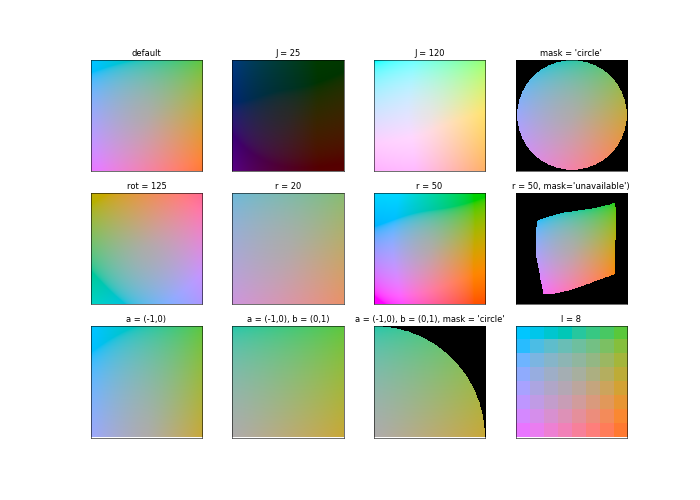
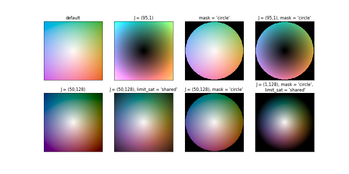
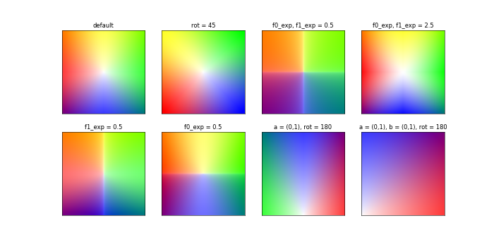
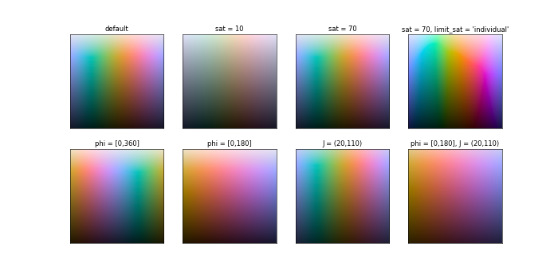
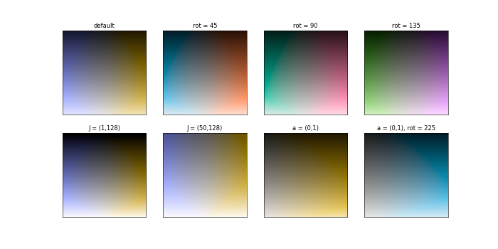
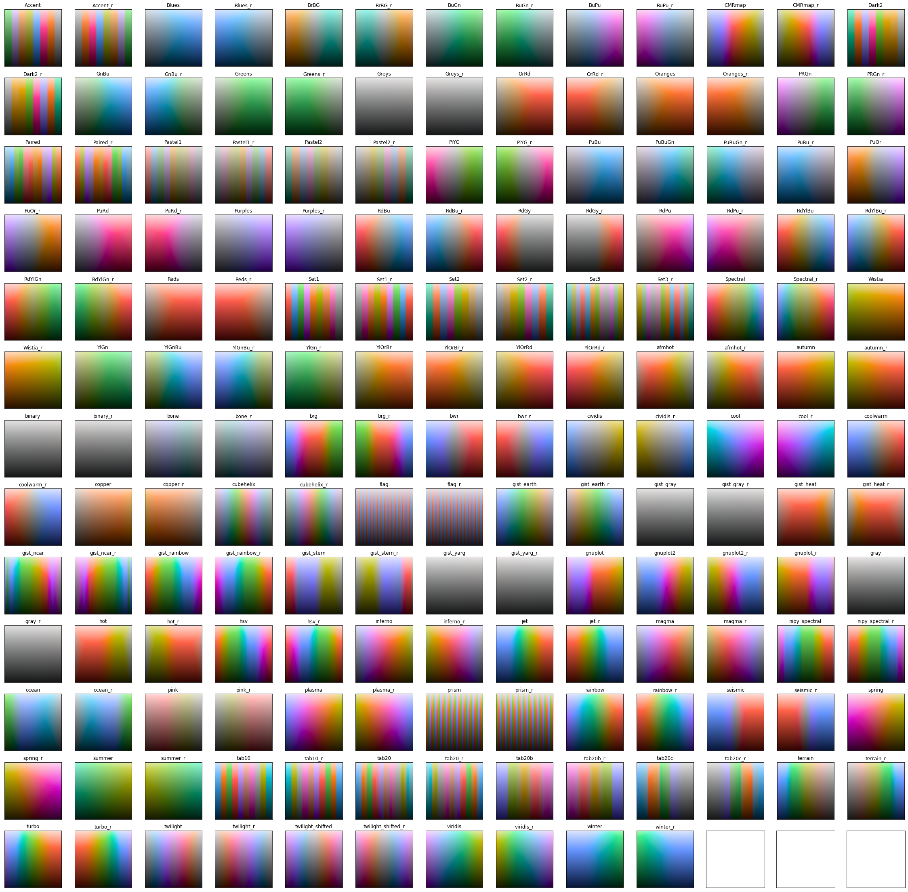

.. _stamps:

colorstamps.stamps module
-------------------------

Colormap by name
#################
colorstamps.stamps.get_cmap() is a getter function that selects the correct function based on the name of the colormap. It is called when a colormap is requested by name in colorstamps.helpers.apply_stamp().

.. autofunction:: colorstamps.stamps.get_cmap

Functions for spesific colormaps
####################################

get_const_J
*************
colorstamps.stamps.get_const_J() is used for the '**flat**' and '**disk**' colormaps

.. autofunction:: colorstamps.stamps.get_const_J

.. code-block:: python

	import matplotlib.pyplot as plt
	import colorstamps
	fig, axes = plt.subplots(3,4,figsize=(14,10), dpi = 50)    

	cmap = colorstamps.stamps.get_const_J()
	axes[0,0].imshow(cmap, origin = 'lower')
	axes[0,0].set_title('default')

	cmap = colorstamps.stamps.get_const_J(J=25)
	axes[0,1].imshow(cmap, origin = 'lower')
	axes[0,1].set_title('J = 25')

	cmap = colorstamps.stamps.get_const_J(J=120, a=(- 1, 1), b=(- 1, 1), r=33.0, l=256, mask='no_mask', rot=0)
	axes[0,2].imshow(cmap, origin = 'lower')
	axes[0,2].set_title('J = 120')

	cmap = colorstamps.stamps.get_const_J(mask = 'circle')
	axes[0,3].imshow(cmap, origin = 'lower')
	axes[0,3].set_title("mask = 'circle'")

	cmap = colorstamps.stamps.get_const_J(rot=125)
	axes[1,0].imshow(cmap, origin = 'lower')
	axes[1,0].set_title('rot = 125')

	cmap = colorstamps.stamps.get_const_J(r=20)
	axes[1,1].imshow(cmap, origin = 'lower')
	axes[1,1].set_title('r = 20')

	cmap = colorstamps.stamps.get_const_J(r=50)
	axes[1,2].imshow(cmap, origin = 'lower')
	axes[1,2].set_title('r = 50')

	cmap = colorstamps.stamps.get_const_J(r=50, mask='unavailable')
	axes[1,3].imshow(cmap, origin = 'lower')
	axes[1,3].set_title("r = 50, mask='unavailable')")

	cmap = colorstamps.stamps.get_const_J( a = (-1,0))
	axes[2,0].imshow(cmap, origin = 'lower')
	axes[2,0].set_title('a = (-1,0)')

	cmap = colorstamps.stamps.get_const_J( a = (-1,0), b = (0,1))
	axes[2,1].imshow(cmap, origin = 'lower')
	axes[2,1].set_title('a = (-1,0), b = (0,1)')

	cmap = colorstamps.stamps.get_const_J(a = (-1,0), b = (0,1), mask = 'circle')
	axes[2,2].imshow(cmap, origin = 'lower')
	axes[2,2].set_title('a = (-1,0), b = (0,1), '+"mask = 'circle'")

	cmap = colorstamps.stamps.get_const_J(l = 8)
	axes[2,3].imshow(cmap, origin = 'lower')
	axes[2,3].set_title('l = 8')

	for ax in axes.ravel():
		ax.set_xticks([])
		ax.set_yticks([])
	fig.patch.set_facecolor('white')
	

get_var_J
*************
colorstamps.stamps.get_var_J() is used for the '**peak**', '**abyss**', '**cone**', and '**funnel**' colormaps

.. autofunction:: colorstamps.stamps.get_var_J

.. code-block:: python

	import matplotlib.pyplot as plt
	import colorstamps
	fig, axes = plt.subplots(2,4,figsize=(14,7), dpi = 50)    

	cmap = colorstamps.stamps.get_var_J()
	axes[0,0].imshow(cmap, origin = 'lower')
	axes[0,0].set_title('default')

	cmap = colorstamps.stamps.get_var_J(J = (95,1))
	axes[0,1].imshow(cmap, origin = 'lower')
	axes[0,1].set_title('J = (95,1)')

	cmap = colorstamps.stamps.get_var_J(mask = 'circle')
	axes[0,2].imshow(cmap, origin = 'lower')
	axes[0,2].set_title("mask = 'circle'")

	cmap = colorstamps.stamps.get_var_J(J = (95,1), mask = 'circle')
	axes[0,3].imshow(cmap, origin = 'lower')
	axes[0,3].set_title("J = (95,1), mask = 'circle'")

	cmap = colorstamps.stamps.get_var_J(J = (50,128))
	axes[1,0].imshow(cmap, origin = 'lower')
	axes[1,0].set_title('J = (50,128)')

	cmap = colorstamps.stamps.get_var_J(J = (50,128), limit_sat = 'shared')
	axes[1,1].imshow(cmap, origin = 'lower')
	axes[1,1].set_title("J = (50,128), limit_sat = 'shared'")

	cmap = colorstamps.stamps.get_var_J(J = (50,128), mask = 'circle')
	axes[1,2].imshow(cmap, origin = 'lower')
	axes[1,2].set_title("J = (50,128), mask = 'circle'")

	cmap = colorstamps.stamps.get_var_J(J = (1,128), mask = 'circle', limit_sat = 'shared')
	axes[1,3].imshow(cmap, origin = 'lower')
	axes[1,3].set_title("J = (1,128), mask = 'circle',\n limit_sat = 'shared'")

	for ax in axes.ravel():
		ax.set_xticks([])
		ax.set_yticks([])
	fig.patch.set_facecolor('white')

four_edges
*************
colorstamps.stamps.four_edges() is used for the '**fourEdges**' and '**fourCorners**' colormaps

.. autofunction:: colorstamps.stamps.four_edges

.. code-block:: python

	import matplotlib.pyplot as plt
	import colorstamps
	fig, axes = plt.subplots(2,4,figsize=(14,7), dpi = 50)    

	cmap = colorstamps.stamps.four_edges()
	axes[0,0].imshow(cmap, origin = 'lower')
	axes[0,0].set_title('default')

	cmap = colorstamps.stamps.four_edges(rot = 45)
	axes[0,1].imshow(cmap, origin = 'lower')
	axes[0,1].set_title('rot = 45')

	cmap = colorstamps.stamps.four_edges(f0_exp = 0.5, f1_exp = 0.5)
	axes[0,2].imshow(cmap, origin = 'lower')
	axes[0,2].set_title('f0_exp, f1_exp = 0.5')

	cmap = colorstamps.stamps.four_edges(f0_exp = 2.5, f1_exp = 2.5)
	axes[0,3].imshow(cmap, origin = 'lower')
	axes[0,3].set_title('f0_exp, f1_exp = 2.5')

	cmap = colorstamps.stamps.four_edges(f0_exp = 2.5)
	axes[1,3].imshow(cmap, origin = 'lower')
	axes[1,3].set_title('f0_exp = 3')

	cmap = colorstamps.stamps.four_edges(f1_exp = 0.5)
	axes[1,0].imshow(cmap, origin = 'lower')
	axes[1,0].set_title('f1_exp = 0.5')

	cmap = colorstamps.stamps.four_edges(f0_exp = 0.5)
	axes[1,1].imshow(cmap, origin = 'lower')
	axes[1,1].set_title('f0_exp = 0.5')

	cmap = colorstamps.stamps.four_edges(a = (-1,0), rot = 180)
	axes[1,2].imshow(cmap, origin = 'lower')
	axes[1,2].set_title('a = (0,1), rot = 180')

	cmap = colorstamps.stamps.four_edges(a = (-1,0), b = (0,1), rot = 180)
	axes[1,3].imshow(cmap, origin = 'lower')
	axes[1,3].set_title('a = (0,1), b = (0,1), rot = 180')

	for ax in axes.ravel():
		ax.set_xticks([])
		ax.set_yticks([])
	fig.patch.set_facecolor('white')
	

	
barrel
*************
colorstamps.stamps.barrel() is used for the '**barrel**' colormap

.. autofunction:: colorstamps.stamps.barrel

.. code-block:: python

	import matplotlib.pyplot as plt
	import colorstamps
	fig, axes = plt.subplots(2,4,figsize=(14,7), dpi = 50)    

	cmap = colorstamps.stamps.barrel()
	axes[0,0].imshow(cmap, origin = 'lower')
	axes[0,0].set_title('default')

	cmap = colorstamps.stamps.barrel(sat = 10)
	axes[0,1].imshow(cmap, origin = 'lower')
	axes[0,1].set_title('sat = 10')

	cmap = colorstamps.stamps.barrel(sat = 70)
	axes[0,2].imshow(cmap, origin = 'lower')
	axes[0,2].set_title('sat = 70')

	cmap = colorstamps.stamps.barrel(sat = 70, limit_sat = 'individual')
	axes[0,3].imshow(cmap, origin = 'lower')
	axes[0,3].set_title("sat = 70, limit_sat = 'individual'")

	cmap = colorstamps.stamps.barrel(phi = [0,360])
	axes[1,0].imshow(cmap, origin = 'lower')
	axes[1,0].set_title("phi = [0,360]")

	cmap = colorstamps.stamps.barrel(phi = [0,180])
	axes[1,1].imshow(cmap, origin = 'lower')
	axes[1,1].set_title("phi = [0,180]")

	cmap = colorstamps.stamps.barrel(J = (20,110))
	axes[1,2].imshow(cmap, origin = 'lower')
	axes[1,2].set_title("J = (20,110)")

	cmap = colorstamps.stamps.barrel(phi = [0,180], J = (20,110))
	axes[1,3].imshow(cmap, origin = 'lower')
	axes[1,3].set_title("phi = [0,180], J = (20,110)")

	for ax in axes.ravel():
		ax.set_xticks([])
		ax.set_yticks([])
	fig.patch.set_facecolor('white')

cut
*************
colorstamps.stamps.cut() is used for the '**cut**', '**blues**', '**reds**', '**greens**', and '**yellows**' colormaps

.. autofunction:: colorstamps.stamps.cut

.. code-block:: python

	import matplotlib.pyplot as plt
	import colorstamps
	fig, axes = plt.subplots(2,4,figsize=(14,7), dpi = 50)    

	cmap = colorstamps.stamps.cut()
	axes[0,0].imshow(cmap, origin = 'lower')
	axes[0,0].set_title("default")

	cmap = colorstamps.stamps.cut(rot = 45)
	axes[0,1].imshow(cmap, origin = 'lower')
	axes[0,1].set_title("rot = 45")

	cmap = colorstamps.stamps.cut(rot = 90)
	axes[0,2].imshow(cmap, origin = 'lower')
	axes[0,2].set_title("rot = 90")

	cmap = colorstamps.stamps.cut(rot = 135)
	axes[0,3].imshow(cmap, origin = 'lower')
	axes[0,3].set_title("rot = 135")

	cmap = colorstamps.stamps.cut(J = (1,128))
	axes[1,0].imshow(cmap, origin = 'lower')
	axes[1,0].set_title("J = (1,128)")

	cmap = colorstamps.stamps.cut(J = (50,128))
	axes[1,1].imshow(cmap, origin = 'lower')
	axes[1,1].set_title("J = (50,128)")

	cmap = colorstamps.stamps.cut(a = (0,1))
	axes[1,2].imshow(cmap, origin = 'lower')
	axes[1,2].set_title("a = (0,1)")

	cmap = colorstamps.stamps.cut(a = (0,1), rot = 225)
	axes[1,3].imshow(cmap, origin = 'lower')
	axes[1,3].set_title("a = (0,1), rot = 225")

	for ax in axes.ravel():
		ax.set_xticks([])
		ax.set_yticks([])
	fig.patch.set_facecolor('white')

teuling
*******************
colorstamps.stamps.teuling() is here shown with the parameters that generate the named colormaps 

.. autofunction:: colorstamps.stamps.teuling

.. code-block:: python

	import matplotlib.pyplot as plt
	import colorstamps
	import numpy as np
	
	fig, axes = plt.subplots(2,4, figsize = (12,7), dpi = 75)

	cmap = colorstamps.stamps.teuling(a = 0.32, order = [0,1,2])
	axes[0,0].imshow(cmap, origin = 'lower')
	axes[0,0].set_title('a = 0.32, order = [0,1,2]')
	cmap = colorstamps.stamps.teuling(a = 0.72, order = [1,0,2])
	axes[0,1].imshow(cmap, origin = 'lower')
	axes[0,1].set_title('a = 0.72, order = [1,0,2]')
	cmap = colorstamps.stamps.teuling(a = 0.32, order = [1,0,2])
	axes[0,2].imshow(cmap, origin = 'lower')
	axes[0,2].set_title('a = 0.32, order = [1,0,2]')
	cmap = colorstamps.stamps.teuling(a = 0.32, order = [1,0,2], green_multiplier = 0.75)
	axes[0,3].imshow(cmap, origin = 'lower')
	axes[0,3].set_title('a = 0.32, order = [1,0,2],\ngreen_multiplier = 0.75')

	cmap = colorstamps.stamps.teuling(a = 0.32, order = [0,1,2], white_center = True)
	axes[1,0].imshow(cmap, origin = 'lower')
	axes[1,0].set_title('a = 0.32, order = [0,1,2],\nwhite_center = True')
	cmap = colorstamps.stamps.teuling(a = 0.72, order = [1,0,2], white_center = True)
	axes[1,1].imshow(cmap, origin = 'lower')
	axes[1,1].set_title('a = 0.72, order = [1,0,2],\nwhite_center = True')
	cmap = colorstamps.stamps.teuling(a = 0.32, order = [1,0,2], )
	axes[1,2].imshow(cmap, origin = 'lower')
	axes[1,2].set_title('a = 0.32, order = [1,0,2],\nwhite_center = True')
	cmap = colorstamps.stamps.teuling(a = 0.32, order = [1,0,2], green_multiplier = 0.75, white_center = True)
	axes[1,3].imshow(cmap, origin = 'lower')
	axes[1,3].set_title('a = 0.32, order = [1,0,2],\ngreen_multiplier = 0.75,\nwhite_center = True')

	for ax in axes.ravel():
	    ax.set_xticks([])
	    ax.set_yticks([])
	    
	fig.patch.set_facecolor('white')

.. image:: ./images/teuling.png

bilinear
*******************

colorstamps.stamps.bilinear() is used for genreating bilinear colormaps in the rgb colorspace

.. autofunction:: colorstamps.stamps.bilinear

.. code-block:: python

	fig, axes = plt.subplots(1,4, figsize = (12,7), dpi = 75)

	cmap = colorstamps.stamps.bilinear(c0 = [1,0.5,0], c1 = [0,0.5,1])
	axes[0].imshow(cmap, origin = 'lower')
	axes[0].set_title('c0 = [1,0.5,0], c1 = [0,0.5,1]')
	cmap = colorstamps.stamps.bilinear(c0 = [0.5,1,0], c1 = [0.5,0,1])
	axes[1].imshow(cmap, origin = 'lower')
	axes[1].set_title('c0 = [0.5,1,0], c1 = [0.5,0,1]')
	cmap = colorstamps.stamps.bilinear(c0 = [0,1,0], c1 = [0,0,1])
	axes[2].imshow(cmap, origin = 'lower')
	axes[2].set_title('c0 = [0,1,0], c1 = [0,0,1]')
	cmap = colorstamps.stamps.bilinear(c0 = [1,0,0], c1 = [0,0,1])
	axes[3].imshow(cmap, origin = 'lower')
	axes[3].set_title('c0 = [1,0,0], c1 = [0,0,1]')

	for ax in axes.ravel():
	    ax.set_xticks([])
	    ax.set_yticks([])
	fig.patch.set_facecolor('white')

.. image:: ./images/bilinear0.png

get_2dcmap_from_mpl
*******************
colorstamps.stamps.get_2dcmap_from_mpl() is used for genreating 2d colormaps from 1d matplotlib colormaps 

.. autofunction:: colorstamps.stamps.get_2dcmap_from_mpl

.. code-block:: python

	import matplotlib.pyplot as plt
	import colorstamps
	import numpy as np
	
	n = int(np.sqrt(len(colorstamps.stamps.mpl_cmaps)))+1
	fig, axes = plt.subplots(n,n, figsize = (20,24))
	axes = axes.ravel()

	for i, name in enumerate(colorstamps.stamps.mpl_cmaps):
	    cmap = colorstamps.stamps.get_2dcmap_from_mpl(name, l = 64, limit_sat = 'individual')
	    axes[i].imshow(cmap, origin = 'lower')
	    axes[i].set_title(name)
	    axes[i].invert_yaxis()
	    
	for ax in axes:
	    ax.set_xticks([])
	    ax.set_yticks([])
	    
	fig.patch.set_facecolor('white')

Helper functions for generating colormaps
##########################################
.. autofunction:: colorstamps.stamps.mask_rgb

.. autofunction:: colorstamps.stamps.set_ab_rot

.. autofunction:: colorstamps.stamps.parse_name_postfix

.. autofunction:: colorstamps.stamps.get_sat_limts

.. autofunction:: colorstamps.stamps.apply_sat_limit

.. autofunction:: colorstamps.stamps.apply_radial_sat_limit

